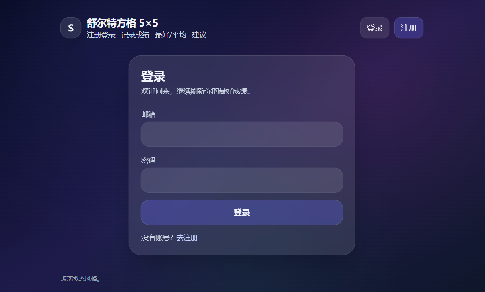
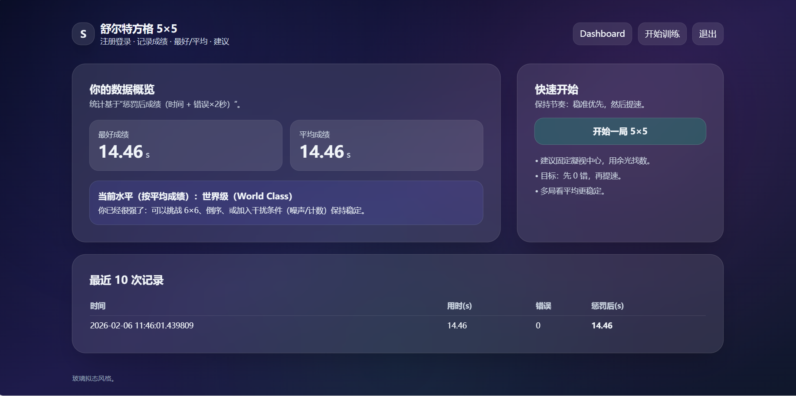
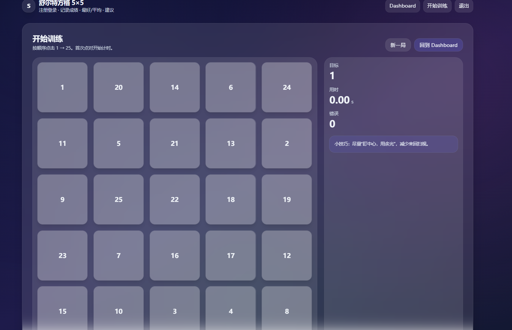

# 🧠 舒尔特方格 5×5（Schulte Focus 5×5）
> 一款「注册登录 + 历史记录 + 最好/平均成绩 + 智能建议」的舒尔特方格训练网页应用。  
> **双击 EXE 即可用**（Windows），或用终端运行（跨平台）。

---

## ✨ 它是什么？
舒尔特方格（Schulte Table）通常是一个随机数字网格（经典为 **5×5 的 1–25**），目标是在尽量少错误的前提下 **按顺序快速定位并点击数字**。它常被用作视觉注意力与搜索策略训练的小工具。  

---

## 🧩 功能亮点
- ✅ **5×5 舒尔特方格训练**：随机 1–25，按顺序点击计时
- ✅ **注册/登录**：每个用户独立保存记录
- ✅ **数据统计**：最好成绩 / 平均成绩 / 最近记录
- ✅ **智能建议**：根据成绩区间给出训练建议
- ✅ **漂亮 UI**：玻璃拟态（Glassmorphism）+ 自适应布局
- ✅ **本地数据库**：默认 SQLite（开箱即用）

---

## 🖼️ 截图 / 演示

- 登录页：
- Dashboard：
- 训练页：


## 🚀 运行方法（优先：EXE 一键启动）
### 方式 1：Windows 双击 EXE（推荐给普通用户）

前往 GitHub 的 Releases 下载 Schulte5x5.zip（你发布时打包）

解压后双击运行：
```
SchulteGame.exe
```
程序会自动启动本地服务并打开浏览器：
```
http://127.0.0.1:8000/login
```

✅ 优点：不用装 Python、不用敲命令，最适合分享给同学/朋友。

🧪 EXE 不行？用终端运行（开发/备用方案）

适用于：EXE 被系统拦截、电脑缺运行库、或你想自己开发修改。

### 方式 2：终端启动（Windows / macOS / Linux 通用）

进入项目根目录（能看到 app_scr/、requirements.txt 的那个目录）
```
cd Schulte-Game
```

创建并激活虚拟环境

Windows PowerShell：
```
python -m venv .venv
.\.venv\Scripts\Activate.ps1
```

macOS/Linux：
```
python3 -m venv .venv
source .venv/bin/activate
```

安装依赖
```
pip install -r requirements.txt
```

启动服务
```
python -m uvicorn app.main:app --reload
```

打开浏览器访问
```
http://127.0.0.1:8000/login
```

### 方式 3：运行简易版的python文件（Windows / macOS / Linux 通用）
如果上述方式都不行的话，那玩家可以直接运行schulte_5x5.py进行游戏体验

## 🗃️ 数据与隐私

默认使用 SQLite 本地数据库（文件通常在项目目录下，如 schulte.db）

每个用户的训练记录都保存在本地数据库中

登录状态使用 Cookie Session（服务端签名校验）

## 🧰 技术栈

FastAPI：Web 后端与路由

Jinja2 Templates：服务端渲染页面

SQLAlchemy + SQLite：数据持久化

Passlib（Argon2/PBKDF2）：密码哈希

PyInstaller：Windows EXE 打包

## 📦 如何自己打包 EXE（维护者/开发者）

如果你准备发布 Releases 给更多人用，建议学会这一步。

### 1）安装 PyInstaller
```
pip install pyinstaller
```
### 2）打包（onedir 更稳，推荐）

Windows PowerShell：
```
python -m PyInstaller --onefile --console --clean --name SchulteGameDebug `
  --collect-submodules fastapi `
  --collect-submodules starlette `
  --collect-submodules sqlalchemy `
  --collect-submodules passlib `
  --hidden-import itsdangerous `
  --hidden-import jinja2 `
  launcher_debug.py
```

生成路径通常为：
```
dist/SchulteGameDebug.exe
```
💡 提示：要先把这个exe文件移动到根目录，与app_src同级！！！如果出现 TemplateNotFound，通常是模板目录没被正确打包或运行时路径没对齐。
维护者可在 app_src/app/main.py 中用 sys._MEIPASS 处理 PyInstaller 的资源路径定位（已在项目内适配）。

## 🧯 常见问题（FAQ）
### 1）打开网页显示 Internal Server Error

终端里如果看到 TemplateNotFound: login.html
✅ 说明模板目录未找到 → 检查打包是否包含 app_src/app/templates，以及运行时模板路径是否正确。

### 2）EXE 启动时报缺少某个模块

多半是 PyInstaller 没把某些动态导入/可选依赖打进去
✅ 解决：在打包命令里增加 --collect-submodules ... 或 --collect-all ...，并确保用 venv 里的 python -m PyInstaller 打包。

🛣️ Roadmap（欢迎提 Issue！）

 多模式：6×6 / 倒序 / 计数干扰

 统计图：最近 30 次趋势折线图

 排行榜：全站 Top10（可选）

 一键导出：CSV/JSON 成绩导出

🤝 Contributing

欢迎 PR / Issue / Feature Request！
如果你是初学者也没关系：

提 Issue 描述你遇到的问题

或者提出你想要的功能（我会把它拆成可完成的任务）

📄 License

建议你给项目加一个开源协议（例如 MIT / Apache-2.0）。
你可以在 GitHub 创建仓库时直接选择 License 模板，或添加 LICENSE 文件。

⭐ 支持一下

如果你觉得这个项目对你有帮助：

给仓库点个 ⭐

分享给需要专注训练/备考的朋友

或者提一个你最想要的功能（我会优先实现）
